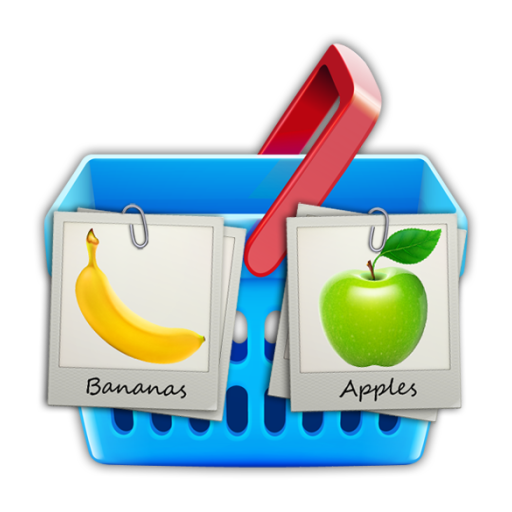

Dejalist
============

This is the official repository containing the source code behind the Dejalist shopping list 
Android application.

Download
--------

You can download the latest version of Dejalist from [Google Play][1].

About
-----

This app is built during the free time of the developer for fun. It also tries to ease the task of 
everyday shopping planning, which is a particularly extremely high complexity problem for 
a typical software developer ;) This app would not work and feel the same way if it weren't for 
some great Android open-source projects that were used during the development.

* [Android Holo ColorPicker][2]
* [Android open source project][3]
* [Android Quill][4]
* [Butter Knife][5]
* [Cupboard for Android][6]
* [Picasso][7]
* [Roman Nurik's Code - Done discard][8]
* [Roman Nurik's Code - Undobar][9]

License
-------

    Copyright 2013 Lyubomir Ganev

    Licensed under the Apache License, Version 2.0 (the "License");
    you may not use this file except in compliance with the License.
    You may obtain a copy of the License at

       http://www.apache.org/licenses/LICENSE-2.0

    Unless required by applicable law or agreed to in writing, software
    distributed under the License is distributed on an "AS IS" BASIS,
    WITHOUT WARRANTIES OR CONDITIONS OF ANY KIND, either express or implied.
    See the License for the specific language governing permissions and
    limitations under the License.

 [1]: https://play.google.com/store/apps/details?id=com.luboganev.dejalist
 [2]: https://github.com/LarsWerkman/HoloColorPicker
 [3]: http://source.android.com/
 [4]: https://code.google.com/p/android-quill/
 [5]: https://github.com/JakeWharton/butterknife
 [6]: https://bitbucket.org/qbusict/cupboard
 [7]: https://square.github.io/picasso/
 [8]: https://code.google.com/p/romannurik-code/source/browse/#git%2Fmisc%2Fdonediscard
 [9]: https://code.google.com/p/romannurik-code/source/browse/#git%2Fmisc%2Fundobar
